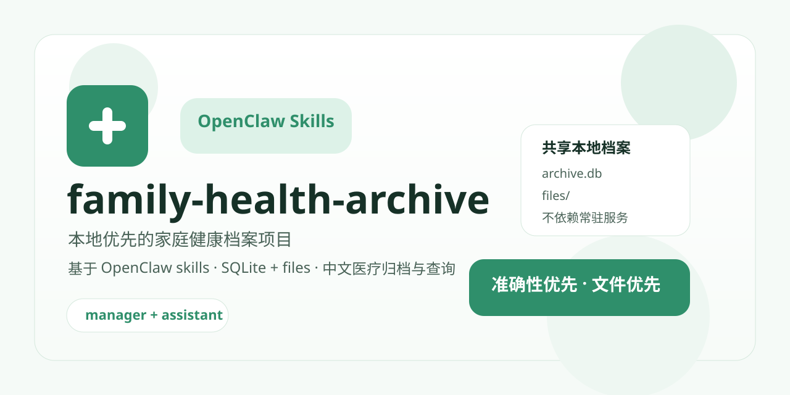

# family-health-archive



[](LICENSE)
[](skills/README.md)
[](#项目定位)

面向 OpenClaw skill 生态的本地优先家庭健康档案项目。

这个仓库的目标不是做一个在线医疗平台，而是提供两组开箱可用的 skill，让用户把家庭成员的医疗资料安全地归档到本地 SQLite + 文件目录中，并在后续查询、总结、趋势分析时始终优先使用本地档案。

## 项目定位

- 面向中国国内使用场景，默认中文输出
- 默认依赖 OpenClaw 当前使用的多模态模型完成图片 / PDF 理解
- 不引入常驻数据库服务
- 不依赖额外大模型服务
- 原始医疗文件和结构化档案都保存在用户本地

## 仓库里有什么

这个仓库包含两个 skill，共享同一个本地健康档案数据库：

1. `health-archive-manager`
   负责写入、归档、建档、重复拦截、质量拒绝。
2. `health-archive-assistant`
   负责读取、汇总、趋势分析、病史上下文整理、图表数据提取。

仓库本身是代码层和 skill 层，不是用户数据目录。

## 数据目录

推荐把数据目录放在代码目录之外。

默认推荐位置：

- macOS / Linux: `~/.family-health-data/`
- Windows: `%USERPROFILE%\\.family-health-data\\`

目录结构：

```text
<data_root>/
  archive.db
  files/
```

含义：

- `archive.db`：结构化档案数据
- `files/`：原始图片、截图、PDF 等源文件

首次使用时，`health-archive-manager` 会负责初始化这个目录和数据库。

## 两个 Skill 的关系

### 1. `health-archive-manager`

这是第一优先 skill，负责把医疗文件真正写进档案。

主要能力：

- 初始化本地档案目录
- 创建家庭成员档案
- 判断文件是否明确属于医疗资料
- 拒绝模糊、截断、不完整的报告
- 人物匹配 / 建档
- 硬重复 / 软重复检测
- 写入 `documents` 和 `observations`

### 2. `health-archive-assistant`

这是读取和分析 skill，默认只读。

主要能力：

- 查询某个人的归档资料
- 提取领域分析 JSON
- 生成病史上下文 JSON
- 生成总结层 JSON
- 生成图表 spec
- 渲染最小中文趋势卡 HTML

它与 `health-archive-manager` 共用同一个数据目录。

如果本地档案尚未初始化，`health-archive-assistant` 应提示用户先安装或先使用 `health-archive-manager` 初始化档案。

## Skill 市场兼容说明

这个项目名不需要强行带 `skill`。

更重要的是仓库内部保持清晰的 skill 结构：

```text
skills/
  health-archive-manager/
    SKILL.md
  health-archive-assistant/
    SKILL.md
```

按常见 skill 项目约定，skill 市场通常更关心：

- 是否有独立的 skill 目录
- 是否有清晰的 `SKILL.md`
- skill 是否能独立说明用途和依赖

因此：

- GitHub 仓库名可以叫 `family-health-archive`
- skill 的机器可识别入口继续保留在 `skills/<slug>/SKILL.md`

这个仓库包含两个 skill，但不同 skill 市场是否支持“一次安装两个 skill”并不一定一致，所以当前项目按更稳妥的方式组织：

- 两个 skill 都能独立识别
- 两个 skill 共享一个本地档案目录
- 推荐先安装 `health-archive-manager`
- 再安装 `health-archive-assistant`

## 当前主流程

### 归档写入

1. 用户发送医疗图片 / 截图 / PDF
2. OpenClaw 当前模型判断文件是否完整、清晰、可靠
3. 模型输出 `medical-archive-result/v1`
4. 本地脚本校验 JSON
5. 本地脚本执行人物匹配、重复检测、入库

### 查询分析

1. 用户询问某位家庭成员的健康问题
2. `health-archive-assistant` 必须优先读取本地档案
3. 提取相关分析 JSON / 病史上下文 / 总结层 JSON
4. 由 OpenClaw 模型基于这些本地结果进行中文解释

## 核心规则

### 准确性优先

如果报告模糊、缺页、截断、混入多张报告或内容不可靠：

- 不归档
- 不存部分指标
- 直接要求重新上传完整清晰的整份报告

### 文件优先

- 原始文件必须保留在本地 `files/`
- 数据库存储结构化事实和索引
- 后续查询、追溯、复核都能回到原文件

### 医疗问题必须优先查本地档案

无论是普通问题还是紧急问题，只要用户在问某位家庭成员的健康情况、历史、趋势、复诊准备、风险提醒，assistant 都应优先使用本地档案，而不是绕过数据库直接凭常识回答。

### 重复数据要保守处理

硬重复：

- 同一文件 `sha256` 相同，直接拦截

软重复：

- 同一人
- 同一日期
- 同一项目 `report_type`

命中后默认判为 `suspected_duplicate`，提示用户确认，不直接再次入库。

## 结果层与展示层

这个项目已经把读取链拆成几层可复用结果：

- `medical-analysis-result/v1`
- `patient-context-result/v1`
- `medical-summary-result/v1`
- `chart-spec/v1`

展示层目前遵循这些规则：

- 中文优先
- 解释型图表优先
- 一张图默认只表达一个关键点
- 血脂默认不做“四项挤在一起的折线图”
- 图负责展示，解释由模型在对话框里完成

## 最小 Demo

### Demo 1：初始化本地档案

```bash
python3 skills/health-archive-manager/scripts/archive_db.py \
  --data-root ~/.family-health-data \
  init
```

### Demo 2：导入一份模型已经提取好的归档结果 JSON

```bash
python3 skills/health-archive-manager/scripts/archive_db.py \
  --data-root ~/.family-health-data \
  process-medical-archive-result \
  --json-file demo/demo-medical-archive-result.json
```

### Demo 3：提取某位成员的血脂分析 JSON

```bash
python3 skills/health-archive-assistant/scripts/archive_analysis.py \
  --data-root ~/.family-health-data \
  --person-id <person_id> \
  --domain lipids
```

### Demo 4：提取某位成员的病史上下文

```bash
python3 skills/health-archive-assistant/scripts/archive_patient_context.py \
  --data-root ~/.family-health-data \
  --person-id <person_id>
```

### Demo 5：渲染一个中文单指标趋势卡

```bash
python3 skills/health-archive-assistant/scripts/render_chart_spec.py \
  --json-file demo/demo-chart-spec.json \
  --output-html demo/demo-chart.html
```

## 主要参考文件

- `PROJECT-DESIGN.md`
- `HANDOFF.md`
- `skills/health-archive-manager/references/schema.md`
- `skills/health-archive-manager/references/medical-archive-result.md`
- `skills/health-archive-manager/references/model-output-guidelines.md`
- `skills/health-archive-assistant/references/medical-analysis-result.md`
- `skills/health-archive-assistant/references/patient-context-result.md`
- `skills/health-archive-assistant/references/medical-summary-result.md`
- `skills/health-archive-assistant/references/display-guidelines.md`
- `skills/health-archive-assistant/references/chart-spec.md`

## 当前状态

目前已经完成：

- 本地 SQLite + files 档案架构
- 人员 / 文档 / 观察模型
- 医疗归档结果 JSON
- 归档 gate / 拒绝 / 重传建议
- 人物匹配 / 建档
- 硬重复 / 软重复检测
- 关系事实基础层
- 分析层 / 病史上下文层 / 总结层
- 展示规范与最小渲染模板

仍然保留到后续迭代的内容：

- 相对称呼解析，例如“我妈 / 我外婆”
- 更丰富的图表模板
- 真实 OpenClaw 对话工作流调优

## 许可证

本项目当前使用 `AGPL-3.0-or-later`。

选择这个许可证的原因是：

- 仍然属于开源许可证
- 允许学习、修改和分发
- 对“改造成网络服务后闭源使用”的约束比宽松许可证更强

## 隐私与安全提醒

本项目采用本地优先架构，但这不等于绝对安全。

用户仍应注意以下潜在风险：

- OpenClaw 本体的行为、日志或后续版本变更
- 其他已安装 skill 对数据的访问
- 第三方通道、聊天平台、同步工具或系统备份
- 设备丢失、被盗、被入侵

更完整的说明见：

- `DISCLAIMER.md`

## 免责声明

本项目用于家庭健康资料整理、查询、辅助总结和风险提醒。

- 不替代医生诊断
- 不替代线下检查和治疗
- 对于急症、剧烈疼痛、意识改变、呼吸困难、严重外伤等情况，应及时就医
